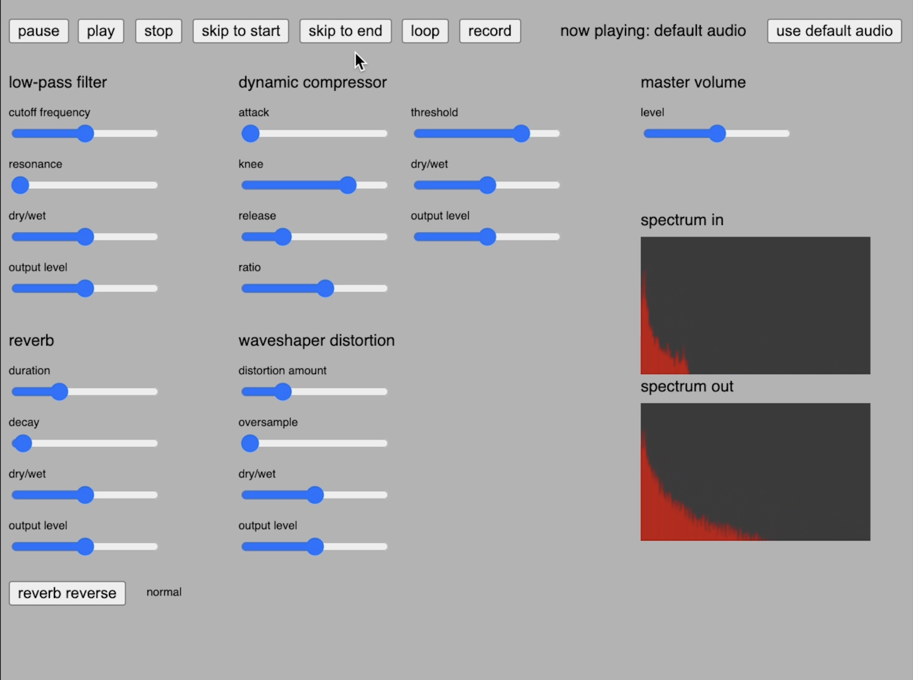

# Audio Effects

## About

This application showcases different audio effects developed in p5.js. The effects are applied in the following order: low-pass filter, waveshaper distortion, dynamic compressor, reverb, master volume. The frequencies of the original and modified audios can be compared using the two spectrums. The user has the option to switch between the live microphone input and the pre-recorded
audio file as the audio source for the application.
